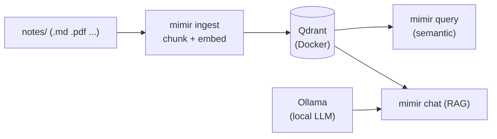

# Quickstart

From a fresh clone to your first answer in about five minutes. This assumes you've
already covered the [installation](installation.md) prerequisites.

## The five-command path

```bash
# 1. Start the Qdrant vector store
docker compose up -d

# 2. Point Mimir at your notes (symlink a vault, or just drop files in ./notes)
ln -s ~/Documents/Obsidian/MyVault notes/vault

# 3. Ingest — walk, chunk, embed, upsert
uv run mimir ingest

# 4. Ask — fast semantic search
uv run mimir query "what did I conclude about market making on Polymarket"

# 5. (optional) Full RAG chat with a local model
uv run mimir chat "summarise my notes on tailoring fabric sourcing"
```

That's the whole loop: **ingest → query → chat**.

## What just happened



1. **Ingest** walked your notes directory, split each document into overlapping
   chunks, embedded them with fastembed, and upserted the vectors into Qdrant.
2. **Query** embedded your search text and returned the top-k most similar chunks
   straight from Qdrant &mdash; no LLM involved.
3. **Chat** retrieved the relevant chunks and passed them to a local Ollama model
   as context, returning an answer with citations.

## Inspect your collection

```bash
uv run mimir status
```

```title="Example output"
Qdrant URL              http://localhost:6333
Collection              mimir
Embed model             BAAI/bge-small-en-v1.5
Vector size             384
Chunk size / overlap    1200 / 150
Notes dir               ./notes
Points indexed          4,213
```

## Re-ingest after editing notes

Re-running `ingest` is cheap &mdash; unchanged files are skipped via a per-file
SHA-256 hash, and only modified files are re-embedded:

```bash
uv run mimir ingest          # incremental
uv run mimir ingest --force  # re-embed everything
```

Want it automatic? See [Live watch &amp; auto-ingest](../guides/watching-files.md).

!!! tip "Filter your searches"
    `query` supports `--folder`, `--ext`, `--title`, and `--k` for narrowing
    results. See the [CLI reference](../reference/cli.md).

<div class="grid cards" markdown>

-   :material-book-open-variant: __[Ingest your Obsidian vault →](../guides/ingest-obsidian.md)__

    A deeper walkthrough for vault users.

-   :material-cog: __[Configuration →](configuration.md)__

    Tune models, chunking, and paths.

</div>
