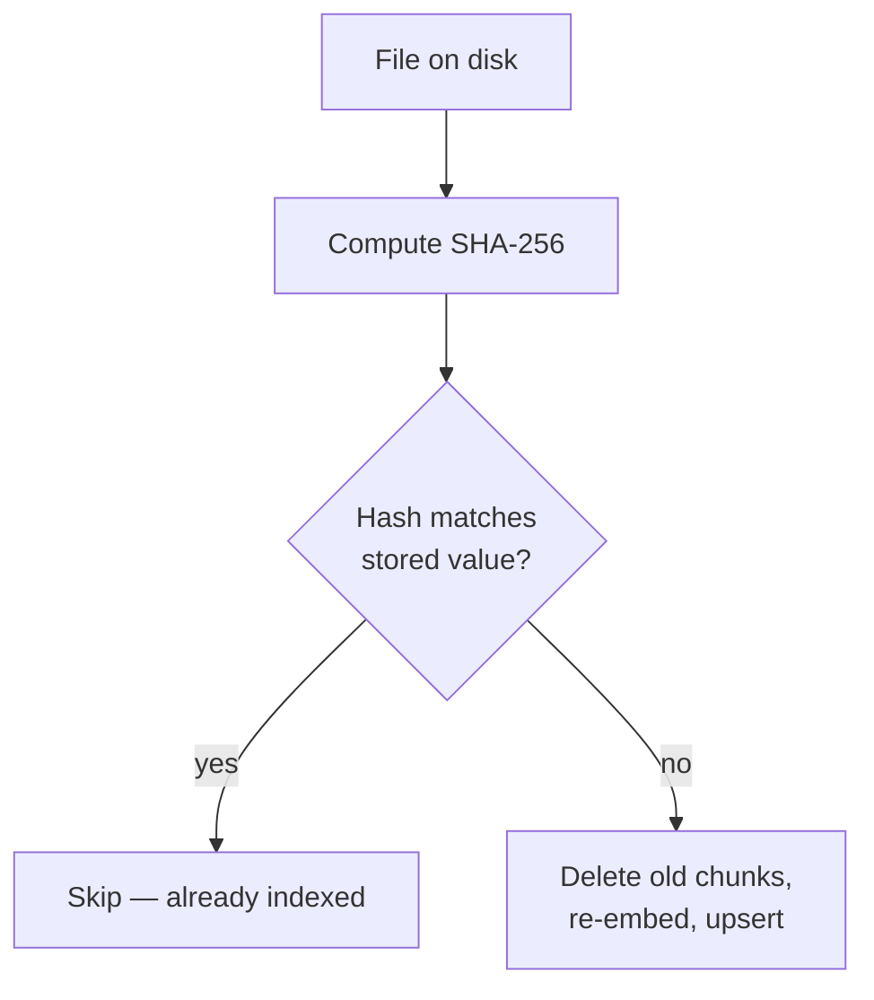

# Ingest your Obsidian vault

Obsidian vaults are just folders of Markdown, which makes them a perfect fit for
Mimir. This guide wires up an existing vault and keeps it indexed.

## 1. Link the vault into `notes/`

Mimir ingests `MIMIR_NOTES_DIR` (default `./notes`). Rather than copy your vault,
symlink it so edits in Obsidian are picked up directly:

```bash
ln -s ~/Documents/Obsidian/MyVault notes/vault
```

You can link multiple vaults or subfolders side by side:

```bash
ln -s ~/Documents/Obsidian/Work notes/work
ln -s ~/Documents/Obsidian/Personal notes/personal
```

!!! tip "Or point Mimir straight at the vault"
    Skip the symlink and ingest the vault in place:

    ```bash
    uv run mimir ingest ~/Documents/Obsidian/MyVault
    ```

## 2. Ingest

```bash
uv run mimir ingest
```

Mimir walks the tree, loads every supported file, chunks it, embeds the chunks,
and upserts them into Qdrant. Supported extensions:

`.md` · `.markdown` · `.txt` · `.pdf` · `.rst` · `.org`

## 3. Query within a folder

Because the relative folder is stored on every chunk, you can scope searches to a
single vault or subfolder:

```bash
uv run mimir query "weekly review takeaways" --folder work
```

Other useful filters:

```bash
uv run mimir query "fabric sourcing" --ext .md --k 10
uv run mimir query "Avellaneda-Stoikov" --title "market-making.md" --full
```

## How incremental ingest works

Each file's content is hashed (SHA-256) and stored alongside its chunks. On the
next ingest:



So re-running `ingest` after editing a handful of notes only touches those notes.
Use `--force` to bypass the check and re-embed everything (e.g. after changing the
embedding model).

## Keeping it in sync

For a vault you edit constantly, run the watcher instead of re-ingesting by hand
&mdash; see [Live watch &amp; auto-ingest](watching-files.md).

!!! note "Attachments and non-text files"
    Images, audio, and other binaries in your vault are ignored. PDFs are parsed
    page by page; a corrupt page is skipped rather than failing the whole file.
