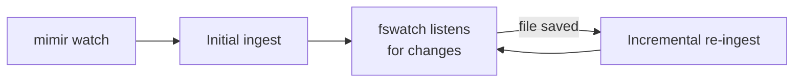

# Live watch &amp; auto-ingest

`mimir watch` keeps your collection in sync automatically: it runs an initial
ingest, then re-ingests whenever a file under the watched path changes.

## Prerequisite: fswatch

The watcher shells out to [`fswatch`](https://github.com/emcrisostomo/fswatch):

```bash
brew install fswatch
```

If `fswatch` isn't on your `PATH`, `mimir watch` exits with an install hint.

## Run the watcher

```bash
uv run mimir watch
```

```title="Example output"
Watching /Users/you/mimir/notes  (Ctrl-C to stop)
change detected — reingesting
change detected — reingesting
```

Point it at a specific path if you don't want the whole notes directory:

```bash
uv run mimir watch notes/work
```

Stop it with ++ctrl+c++.

## How it behaves



Each re-ingest is incremental, so only changed files are re-embedded &mdash; the
same SHA-256 skip logic as a manual `ingest`. The `--latency=2` setting batches
rapid saves so a flurry of edits triggers one re-ingest rather than many.

!!! tip "Leave it running in a split pane"
    Keep `mimir watch` in one terminal while you write in Obsidian. By the time
    you switch over to `query` or `chat`, your edits are already indexed.

!!! note "Watch vs. cron"
    `watch` is ideal for an active editing session. For a vault you only touch
    occasionally, a plain `mimir ingest` on demand is simpler.
