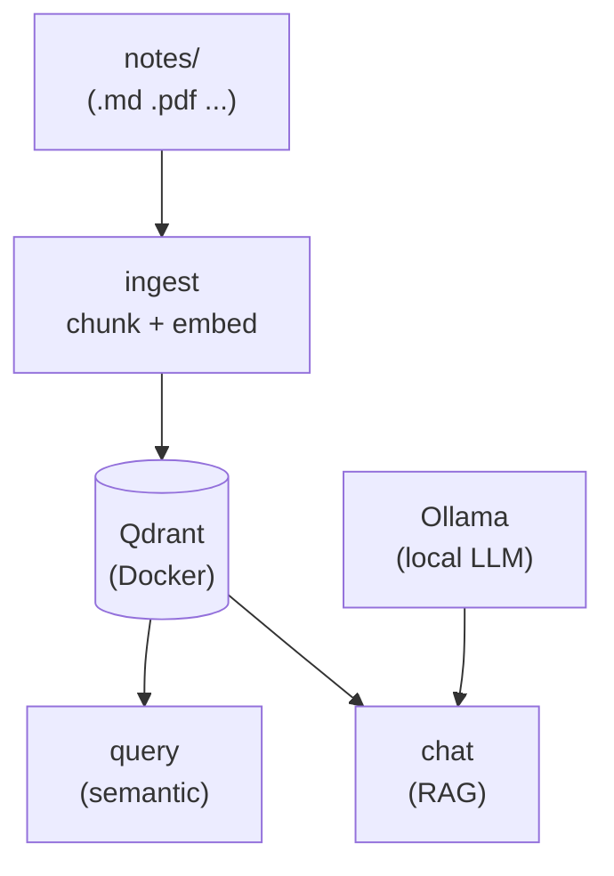

# Architecture

Mimir is a small, local-first pipeline. Notes go in, embeddings get stored in a
local vector database, and you query them either as semantic search or as full
RAG with a local LLM. Nothing leaves your machine.

## Components

| Component | Role |
|---|---|
| **Qdrant** | Vector store, a single Docker container. |
| **fastembed** | Embeddings via `BAAI/bge-small-en-v1.5` (384d, ONNX, native on Apple Silicon). |
| **Ollama** | Local LLM for the `chat` command (optional). |
| **Typer** | The single `mimir` CLI for everything. |

## Module map

| Module | Responsibility |
|---|---|
| `mimir.cli` | Typer app and all subcommands. |
| `mimir.config` | `pydantic-settings` configuration from `MIMIR_*` / `.env`. |
| `mimir.db` | Qdrant client and collection lifecycle. |
| `mimir.embeddings` | Cached fastembed wrapper (model loaded once per process). |
| `mimir.loaders` | File loaders for `.md`, `.txt`, `.pdf`, `.rst`, `.org`. |
| `mimir.chunking` | Paragraph- and sentence-aware sliding-window chunker. |
| `mimir.ingest` | The walk → chunk → embed → upsert pipeline. |
| `mimir.query` | Semantic search and the `Hit` dataclass. |
| `mimir.chat` | RAG: retrieve → build prompt → stream from Ollama. |

## Data flow

1. **Ingest** walks the notes directory, chunks each document, embeds the chunks
   with fastembed, and upserts the vectors into Qdrant. Unchanged files are
   skipped on re-ingest via a per-file SHA-256 hash.
2. **Query** embeds your search text and returns the top-k most similar chunks
   straight from Qdrant &mdash; no LLM involved.
3. **Chat** retrieves the relevant chunks, then passes them to a local Ollama
   model as context, returning an answer with citations back to your notes.

## Design choices worth knowing

- **Deterministic point IDs** &mdash; each chunk's ID is derived from
  `sha256(path:chunk_idx)`, so re-upserting the same chunk is idempotent.
- **Pre-built payload indexes** on `path`, `ext`, `folder`, `title`, and
  `file_hash` keep filtered queries fast.
- **Cached embedder** &mdash; the fastembed model is an `lru_cache`'d singleton,
  loaded once per process, with a separate query-prefixed path for searches.
- **Strictly grounded RAG** &mdash; the chat system prompt instructs the model to
  answer using only the retrieved context, reducing hallucination.
